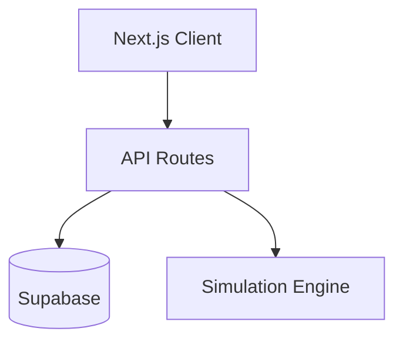

# Architecture Overview

This document provides a high-level view of the Arcane Dominion application.

The client renders the user interface, API routes orchestrate actions and state transitions,
and the engine powers core simulation logic backed by Supabase storage.
