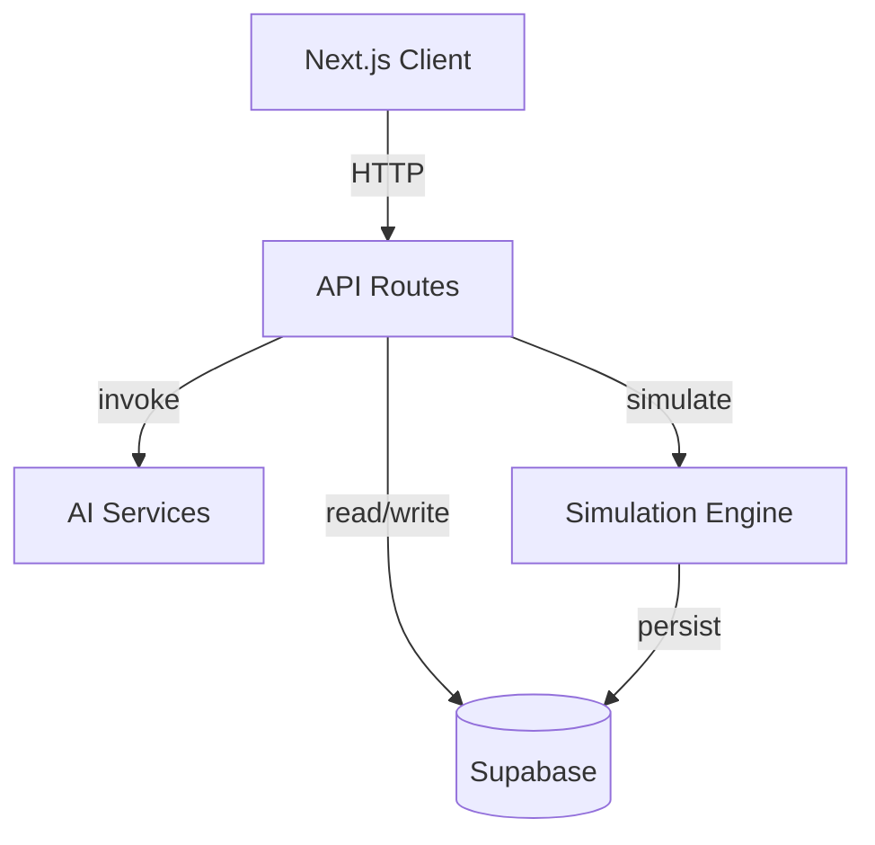
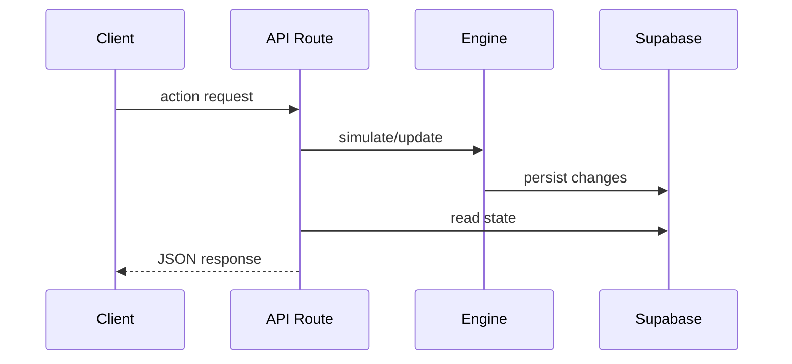

# Architecture Overview

This document explains the runtime structure and data flow of the Arcane Dominion application.

## System Context

## Components

### Client (Next.js App Router)
- Renders the user interface from `src/app`.
- Calls API routes for game actions and state.
- Hydrates session and game state from Supabase.

### API Layer
- Next.js route handlers under `src/app/api`.
- Validates requests with Zod schemas.
- Orchestrates agents, simulation, and persistence.

### Simulation Engine (`packages/engine`)
- Headless game logic executed server-side.
- Modules for tick application, traffic, zoning, and transport.
- Pure TypeScript for deterministic tests.

### Supabase
- Postgres database and authentication.
- Tables `game_state` and `proposals` store core state.
- Row-level security keeps client reads read-only.

### AI Agents
- OpenAI-backed agents invoked from API routes.
- Generate proposals and conservative forecasts.

## Request Lifecycle

A player interaction triggers an API route. The route invokes the simulation engine, persists
state to Supabase, optionally calls AI agents, and returns a JSON response to the client.
