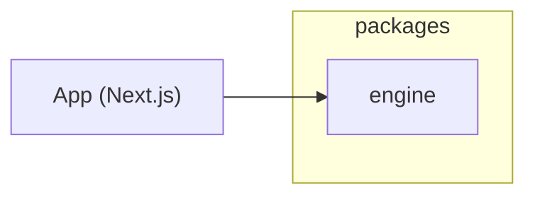

# Package Diagram

The codebase is a small monorepo composed of a Next.js application and a reusable
simulation engine published as an internal package.

## packages/engine

The engine exposes deterministic game mechanics as a standalone TypeScript library.

- `src/simulation/index.ts` – orchestrates tick execution.
- `src/simulation/traffic` – vehicle and pedestrian flow.
- `src/simulation/zoning` – zone management and effects.
- `src/simulation/transport` – public transport routes and vehicles.

The application imports these modules to apply game rules while keeping the engine
isolated and testable.
