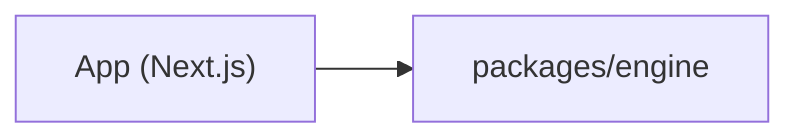

# Package Diagram

The repository currently includes a Next.js app and a reusable simulation engine.

```mermaid
graph LR
    App["App (Next.js)"] --> Engine["packages/engine"]
```

The app depends on the engine package for simulation behavior.
